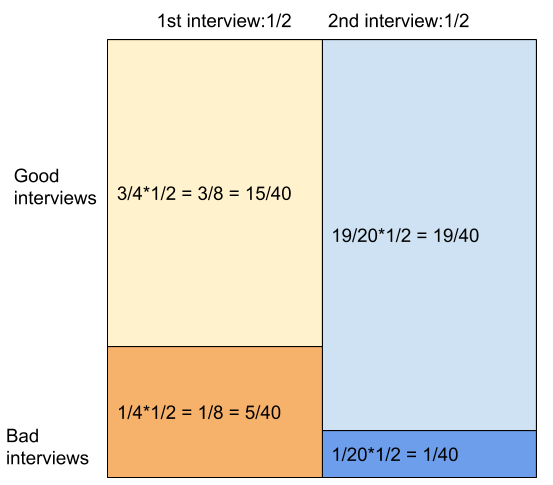

Question: Given the information below, 
if you had a good first interview, 
what is the probability you will receive a second interview?
- 50% of all people who received a first interview received a second interview
- 95% of people that received a second interview had a good first interview
- 75% of people that did not receive a second interview had a good first interview

# graphically 

From this graph, it's easy to see that good interviews are 15+19=34. 
The number of second interviews among those is 19.
So 19/34.

# with bayes

We are looking for p(2|g), given:
- p(2|1) = 1/2 = p(2)
- p(g|2) = 19/20 = p(g).p(2|g)/p(2)
- p(g|not 2) = 3/4 = p(g).(1-p(g|2))/(1-p(2))

Assuming everyone goes to first interview, p(2) = p(2|1) = 1/2, 
so we have system of 2 equations with 2 unknowns:
- p(g).p(2|g) = 19/40
- p(g).(1-p(2|g)) = 3/8

Transforming this gives p(2|g) = 19/34
